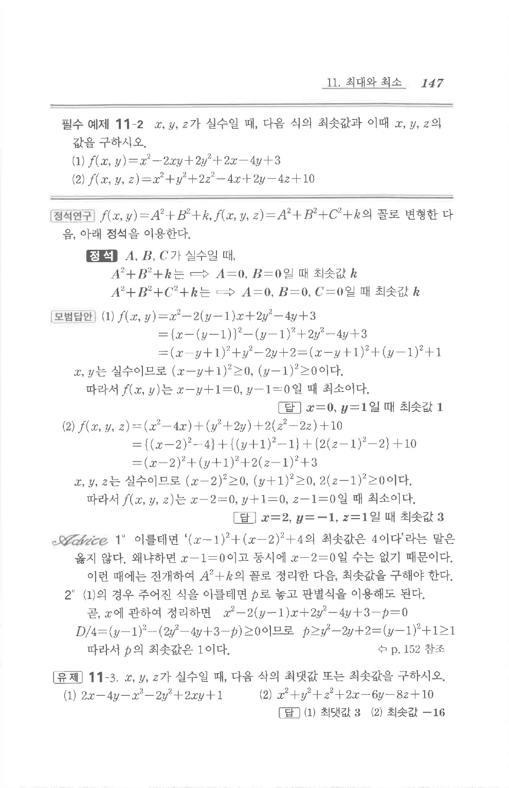

# 필수 예제 11-2

## 문제

$x,y,z$가 실수일 때, 다음 식의 최솟값과 이때 $x,y,z$의 값을 구하시오.

1. $f(x,y)=x^2-2xy+2y^2+2x-4y+3$
2. $f(x,y,z)=x^2+y^2+2z^2-4x+2y-4z+10$

## 정답

1. $x=0,\ y=1$일 때 최솟값 $1$
2. $x=2,\ y=-1,\ z=1$일 때 최솟값 $3$

## 원문 문제

## 원문

