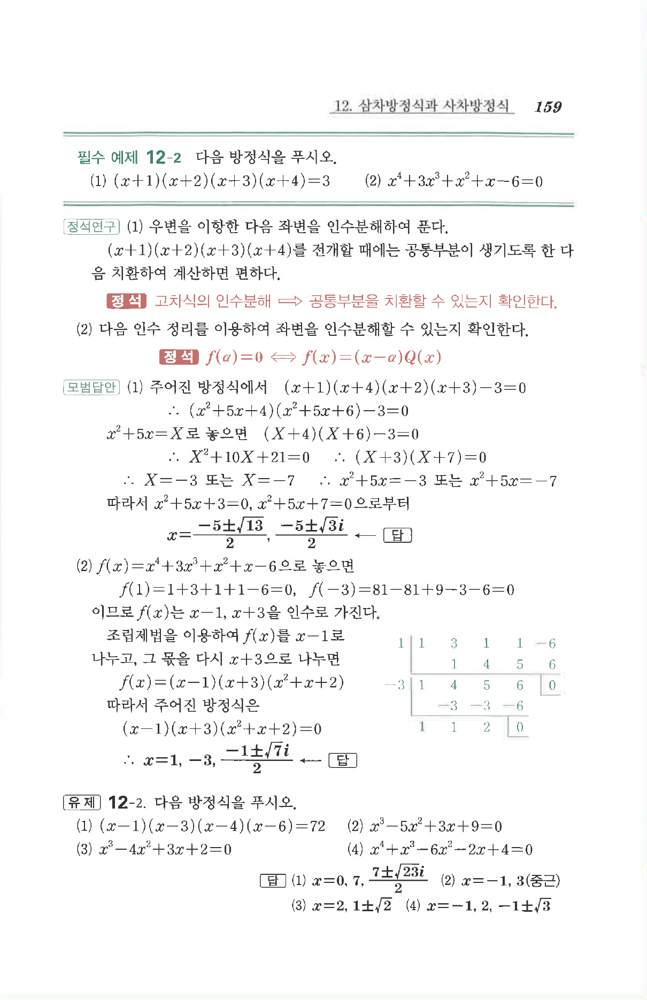

# 필수 예제 12-2

## 문제

다음 방정식을 푸시오.

1. $$(x+1)(x+2)(x+3)(x+4)=3$$
2. $$x^4+3x^3+x^2+x-6=0$$

## 정답

1. $$x=\frac{-5\pm\sqrt{13}}2,\ \frac{-5\pm\sqrt3 i}2$$
2. $$x=1,\ -3,\ \frac{-1\pm\sqrt7 i}2$$

## 원문

