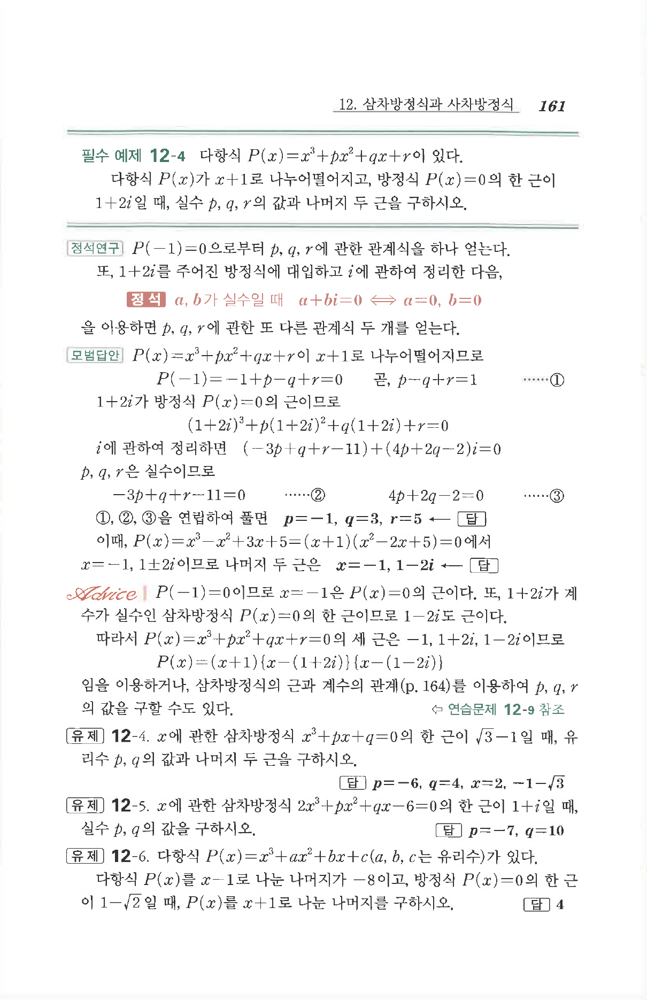

# 필수 예제 12-4

## 문제

다항식

$$P(x)=x^3+px^2+qx+r$$

이 있다. 다항식 $P(x)$가 $x+1$로 나누어떨어지고, 방정식 $P(x)=0$의 한 근이 $1+2i$일 때, 실수 $p,q,r$의 값과 나머지 두 근을 구하시오.

## 정답

$$p=-1,\quad q=3,\quad r=5$$

나머지 두 근은

$$x=-1,\ 1-2i$$

## 원문

