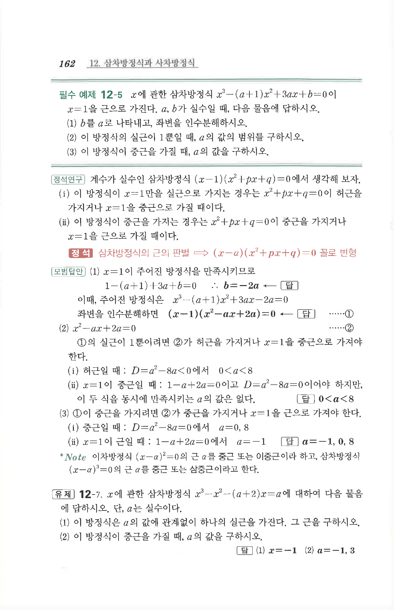

# 필수 예제 12-5

## 문제

$x$에 관한 삼차방정식

$$x^3-(a+1)x^2+3ax+b=0$$

이 $x=1$을 근으로 가진다. $a,b$가 실수일 때, 다음 물음에 답하시오.

1. $b$를 $a$로 나타내고, 좌변을 인수분해하시오.
2. 이 방정식의 실근이 $1$뿐일 때, $a$의 값의 범위를 구하시오.
3. 이 방정식이 중근을 가질 때, $a$의 값을 구하시오.

## 정답

1. $$b=-2a,\quad (x-1)(x^2-ax+2a)=0$$
2. $$0<a<8$$
3. $$a=-1,\ 0,\ 8$$

## 원문

