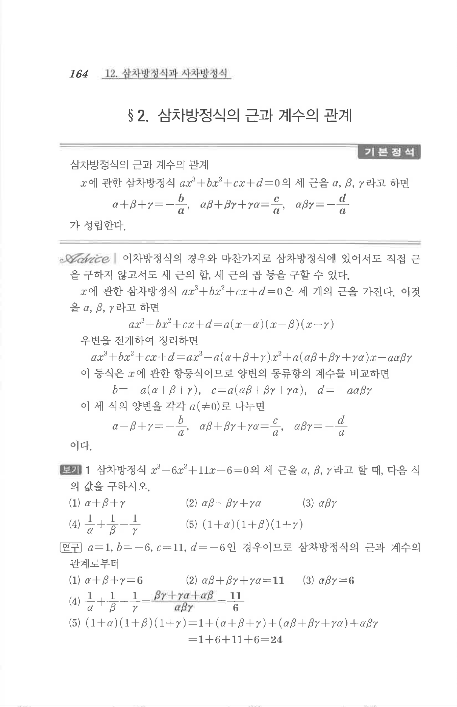

# §2 보기 1

## 문제

삼차방정식

$$x^3-6x^2+11x-6=0$$

의 세 근을 $\alpha,\beta,\gamma$라고 할 때, 다음 식의 값을 구하시오.

1. $$\alpha+\beta+\gamma$$
2. $$\alpha\beta+\beta\gamma+\gamma\alpha$$
3. $$\alpha\beta\gamma$$
4. $$\frac1\alpha+\frac1\beta+\frac1\gamma$$
5. $$(1+\alpha)(1+\beta)(1+\gamma)$$

## 정답

1. $$6$$
2. $$11$$
3. $$6$$
4. $$\frac{11}{6}$$
5. $$24$$

## 원문

