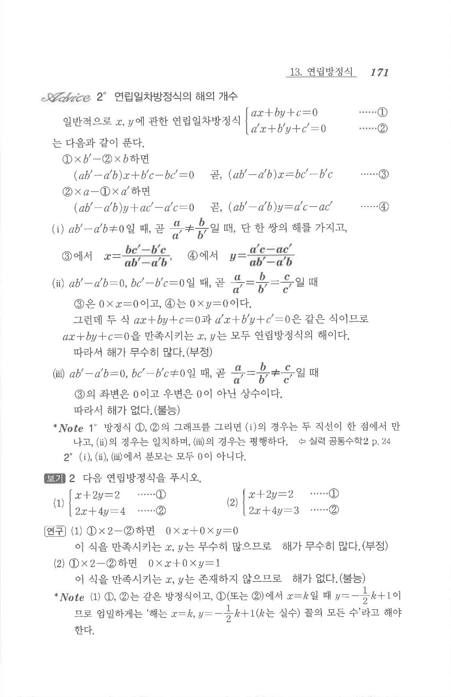

# §1 보기 2

## 문제

다음 연립방정식을 푸시오.

1. $$\begin{cases}x+2y=2\\2x+4y=4\end{cases}$$
2. $$\begin{cases}x+2y=2\\2x+4y=3\end{cases}$$

## 정답

1. 해가 무수히 많다. $x=k,\ y=-\frac12k+1$ ($k$는 실수)
2. 해가 없다.

## 원문

