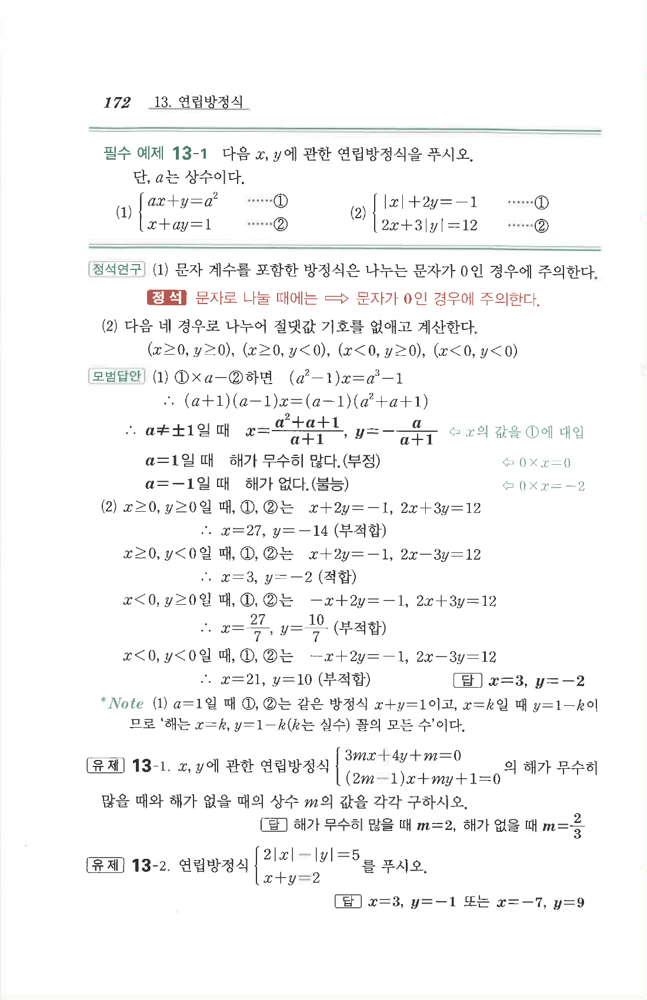

# 필수 예제 13-1

## 문제

다음 $x,y$에 관한 연립방정식을 푸시오. 단, $a$는 상수이다.

1. $$\begin{cases}ax+y=a^2\\x+ay=1\end{cases}$$
2. $$\begin{cases}|x|+2y=-1\\2x+3|y|=12\end{cases}$$

## 정답

1. $a\ne\pm1$일 때
   $$x=\frac{a^2+a+1}{a+1},\quad y=-\frac{a}{a+1}$$
   $a=1$일 때 해가 무수히 많고, $a=-1$일 때 해가 없다.
2. $$x=3,\quad y=-2$$

## 원문

