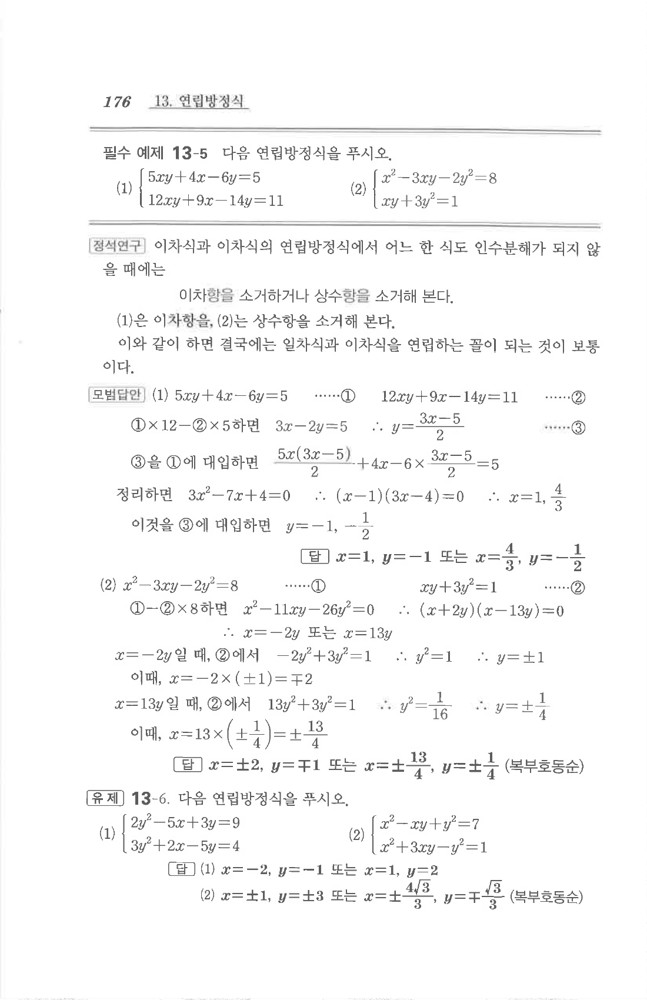

# 필수 예제 13-5

## 문제

다음 연립방정식을 푸시오.

1. $$\begin{cases}5xy+4x-6y=5\\12xy+9x-14y=11\end{cases}$$
2. $$\begin{cases}x^2-3xy-2y^2=8\\xy+3y^2=1\end{cases}$$

## 정답

1. $$x=1,\ y=-1\quad \text{또는}\quad x=\frac43,\ y=-\frac12$$
2. $$x=\pm2,\ y=\mp1\quad \text{또는}\quad x=\pm\frac{13}{4},\ y=\pm\frac14$$
   두 번째 묶음은 복부호동순이다.

## 원문

