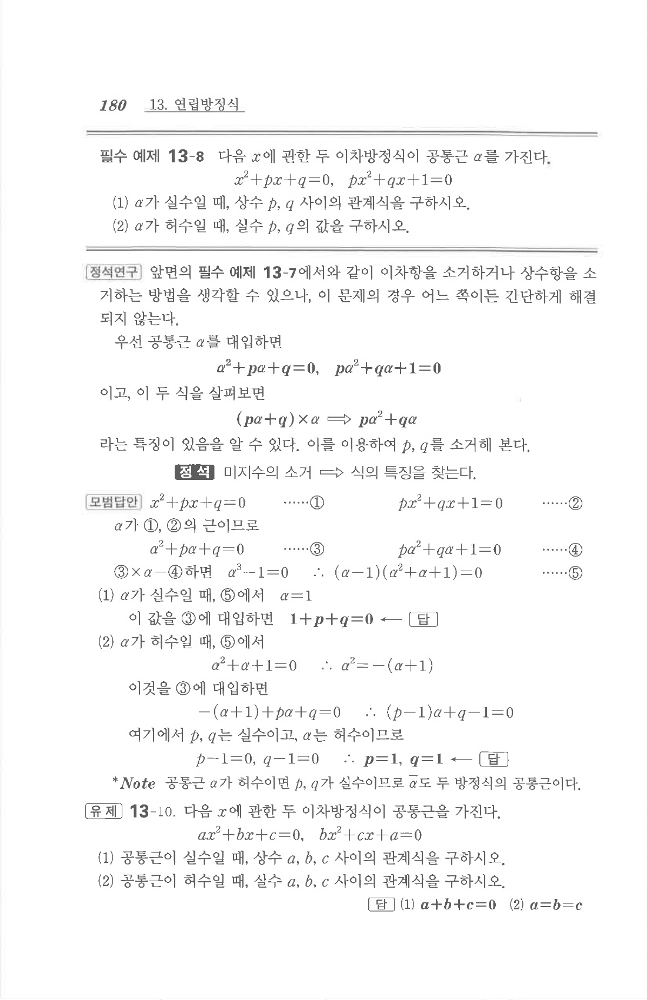

# 필수 예제 13-8

## 문제

다음 $x$에 관한 두 이차방정식이 공통근 $\alpha$를 가진다.

$$x^2+px+q=0,\quad px^2+qx+1=0$$

1. $\alpha$가 실수일 때, 상수 $p,q$ 사이의 관계식을 구하시오.
2. $\alpha$가 허수일 때, 실수 $p,q$의 값을 구하시오.

## 정답

1. $$1+p+q=0$$
2. $$p=1,\quad q=1$$

## 원문

