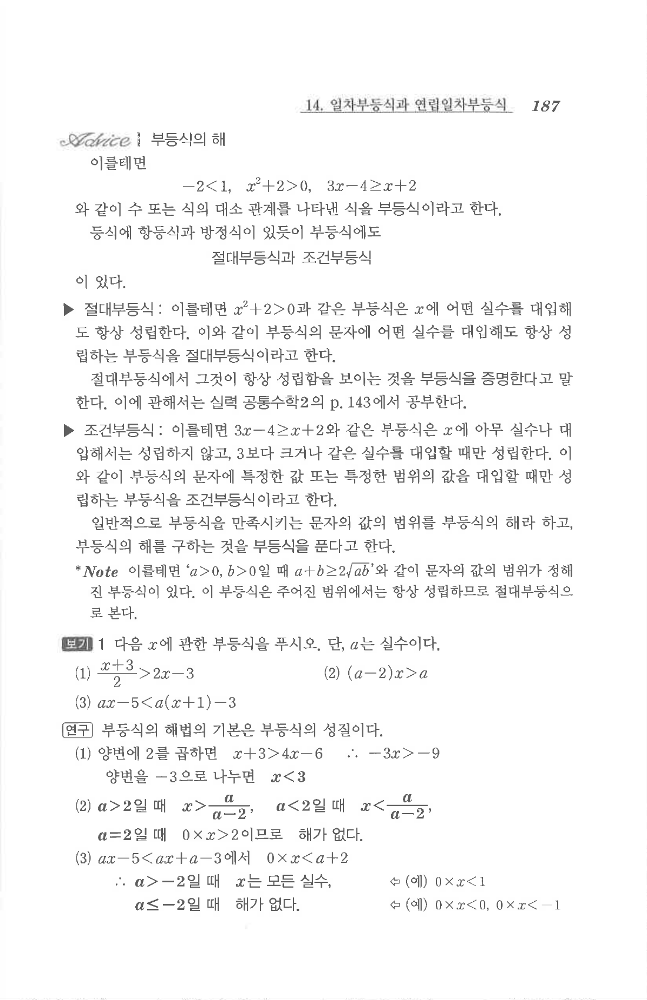

# S1 보기 1

## 문제

다음 $x$에 관한 부등식을 푸시오. 단, $a$는 실수이다.

1. $$\frac{x+3}{2}>2x-3$$
2. $$(a-2)x>a$$
3. $$ax-5<a(x+1)-3$$

## 정답

1. $$x<3$$
2. $a>2$일 때 $$x>\dfrac{a}{a-2}$$  
   $a<2$일 때 $$x<\dfrac{a}{a-2}$$  
   $a=2$일 때 해가 없다.
3. $a>-2$일 때 모든 실수, $a\le -2$일 때 해가 없다.

## 원문

