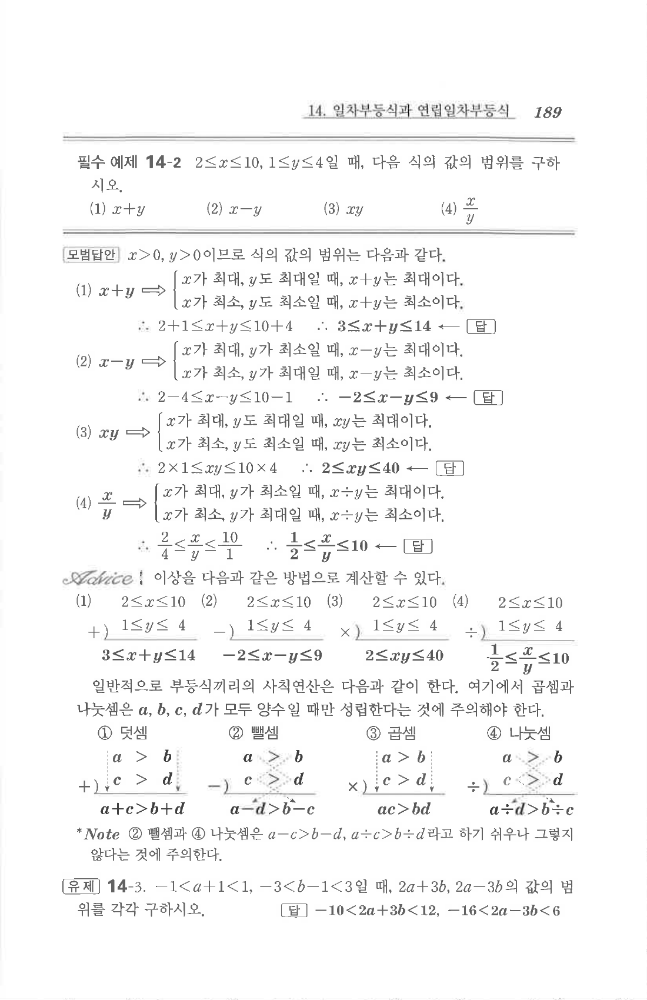

# 필수 예제 14-2

## 문제

$2\le x\le 10$, $1\le y\le 4$일 때, 다음 값의 범위를 구하시오.

1. $x+y$
2. $x-y$
3. $xy$
4. $\dfrac{x}{y}$

## 정답

1. $$3\le x+y\le 14$$
2. $$-2\le x-y\le 9$$
3. $$2\le xy\le 40$$
4. $$\dfrac12\le \dfrac{x}{y}\le 10$$

## 원문

