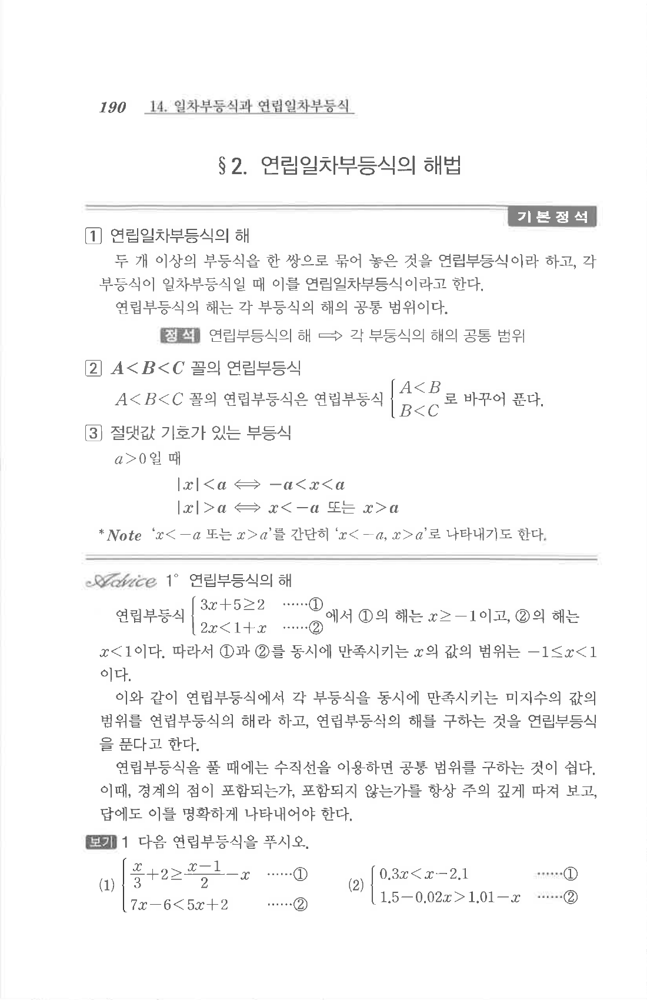

# S2 보기 1

## 문제

다음 연립부등식을 푸시오.

1. $$\begin{cases}\dfrac{x}{3}+2\ge \dfrac{x-1}{2}-x\\7x-6<5x+2\end{cases}$$
2. $$\begin{cases}0.3x<x-2.1\\1.5-0.02x>1.01-x\end{cases}$$

## 정답

1. $$-3\le x<4$$
2. $$x>3$$

## 원문

