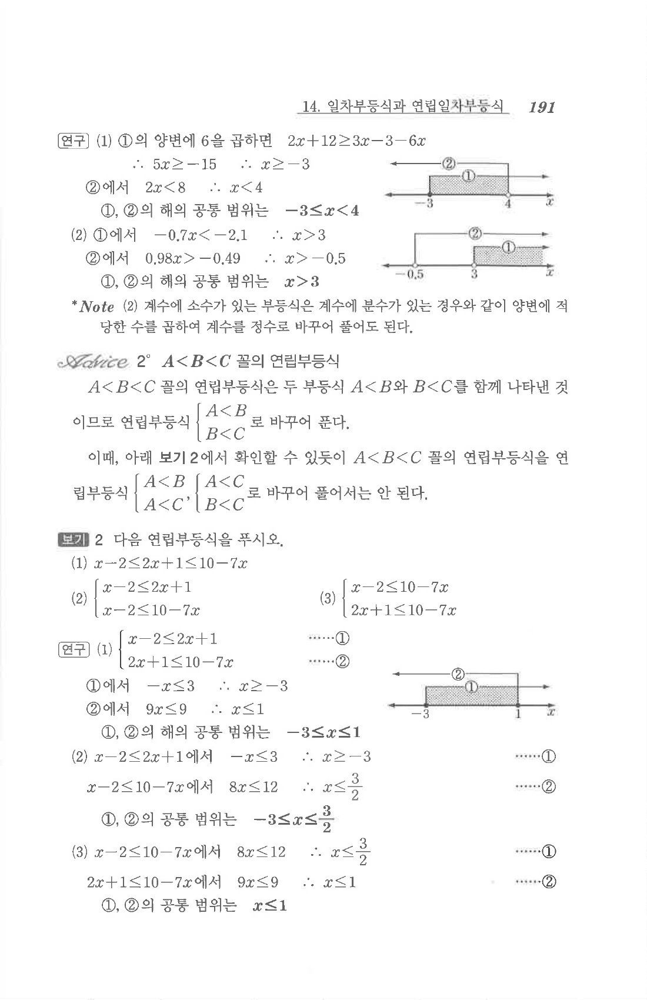

# S2 보기 2

## 문제

다음 연립부등식을 푸시오.

1. $$x-2\le 2x+1\le 10-7x$$
2. $$\begin{cases}x-2\le 2x+1\\x-2\le 10-7x\end{cases}$$
3. $$\begin{cases}x-2\le 10-7x\\2x+1\le 10-7x\end{cases}$$

## 정답

1. $$-3\le x\le 1$$
2. $$-3\le x\le \dfrac32$$
3. $$x\le 1$$

## 원문

