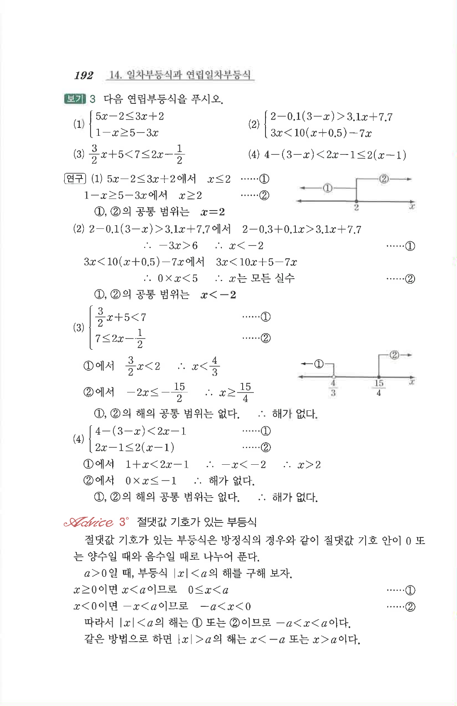

# S2 보기 3

## 문제

다음 연립부등식을 푸시오.

1. $$\begin{cases}5x-2\le 3x+2\\1-x\ge 5-3x\end{cases}$$
2. $$\begin{cases}2-0.1(3-x)>3.1x+7.7\\3x<10(x+0.5)-7x\end{cases}$$
3. $$\dfrac32x+5<7\le 2x-\dfrac12$$
4. $$4-(3-x)<2x-1\le 2(x-1)$$

## 정답

1. $$x=2$$
2. $$x<-2$$
3. 해가 없다.
4. 해가 없다.

## 원문

