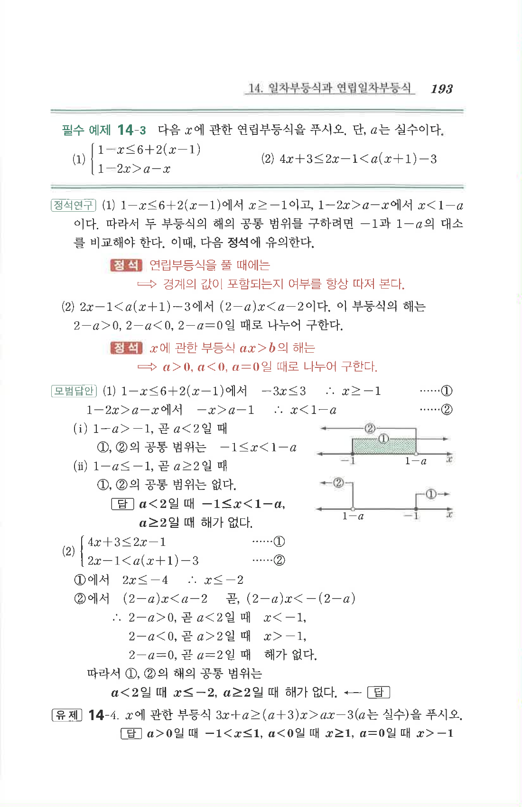

# 필수 예제 14-3

## 문제

다음 $x$에 관한 연립부등식을 푸시오. 단, $a$는 실수이다.

1. $$\begin{cases}1-x\le 6+2(x-1)\\1-2x>a-x\end{cases}$$
2. $$4x+3\le 2x-1<a(x+1)-3$$

## 정답

1. $a<2$일 때 $$-1\le x<1-a$$  
   $a\ge 2$일 때 해가 없다.
2. $a<2$일 때 $$x\le -2$$  
   $a\ge 2$일 때 해가 없다.

## 원문

