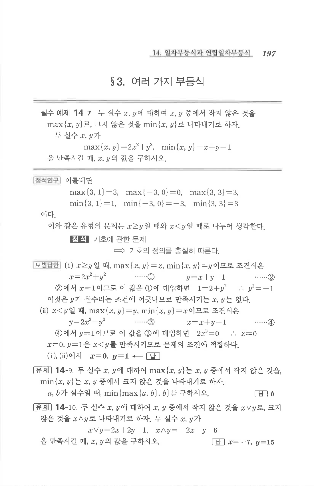

# 필수 예제 14-7

## 문제

두 실수 $x,y$에 대하여 $x,y$ 중에서 작지 않은 것을 $\max\{x,y\}$로, 크지 않은 것을 $\min\{x,y\}$로 나타내기로 하자. 두 실수 $x,y$가

$$\max\{x,y\}=2x^2+y^2,\qquad \min\{x,y\}=x+y-1$$

을 만족시킬 때, $x,y$의 값을 구하시오.

## 정답

$$x=0,\quad y=1$$

## 원문

