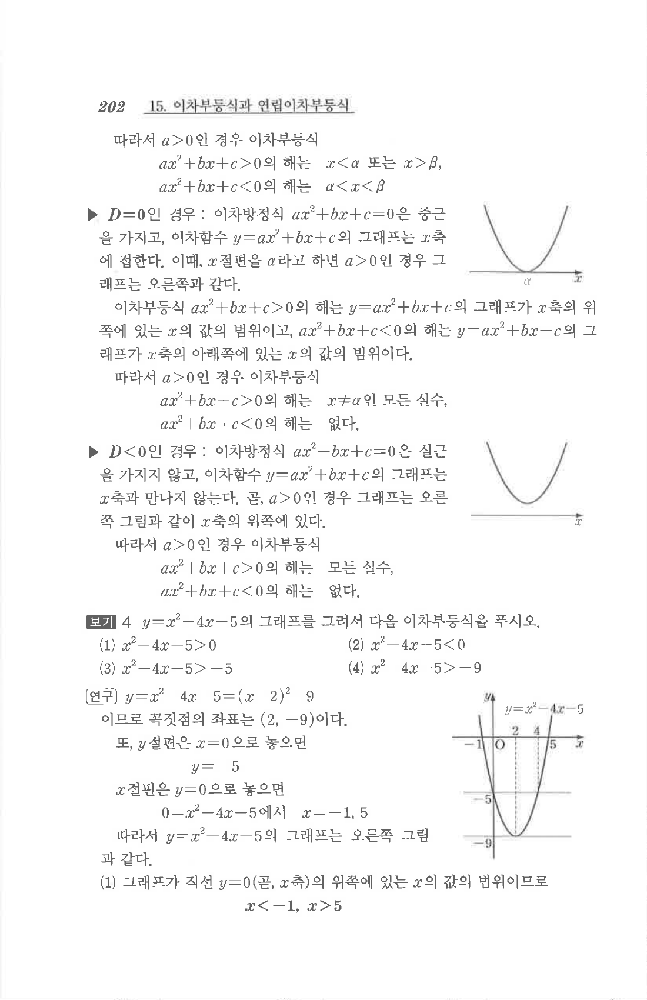
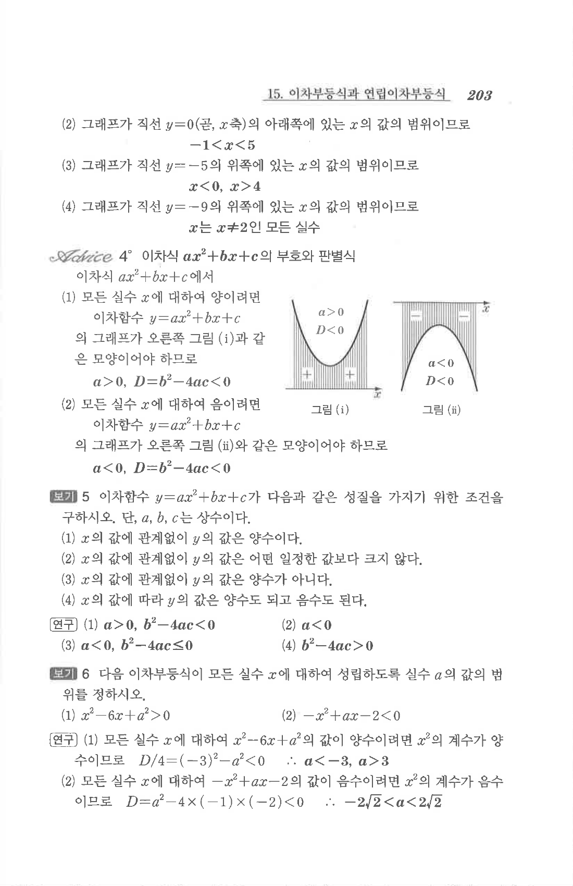

# S1 보기 4

## 문제

$y=x^2-4x-5$의 그래프를 그려서 다음 이차부등식을 푸시오.

1. $$x^2-4x-5\ge0$$
2. $$x^2-4x-5<0$$
3. $$x^2-4x-5>-5$$
4. $$x^2-4x-5>-9$$

## 정답

1. $$x\le -1\quad\text{또는}\quad x\ge5$$
2. $$-1<x<5$$
3. $$x<0\quad\text{또는}\quad x>4$$
4. $x$는 $x\ne2$인 모든 실수

## 원문

