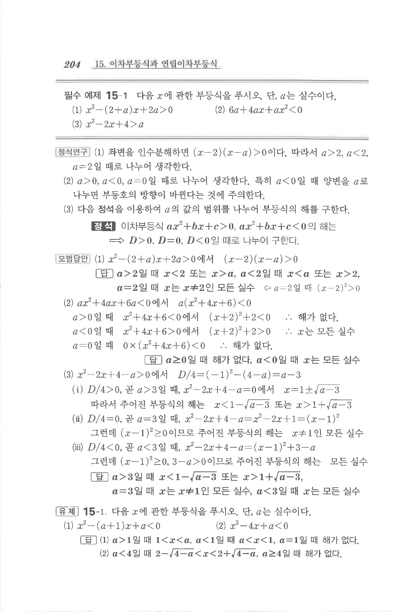

# 필수 예제 15-1

## 문제

다음 $x$에 관한 부등식을 푸시오. 단, $a$는 실수이다.

1. $$x^2-(2+a)x+2a>0$$
2. $$6a+4ax+ax^2<0$$
3. $$x^2-2x+4>a$$

## 정답

1. $a>2$일 때 $$x<2\quad\text{또는}\quad x>a$$  
   $a<2$일 때 $$x<a\quad\text{또는}\quad x>2$$  
   $a=2$일 때 $x$는 $x\ne2$인 모든 실수.
2. $a\ge0$일 때 해가 없고, $a<0$일 때 $x$는 모든 실수.
3. $a>3$일 때 $$x<1-\sqrt{a-3}\quad\text{또는}\quad x>1+\sqrt{a-3}$$  
   $a=3$일 때 $x$는 $x\ne1$인 모든 실수.  
   $a<3$일 때 $x$는 모든 실수.

## 원문

