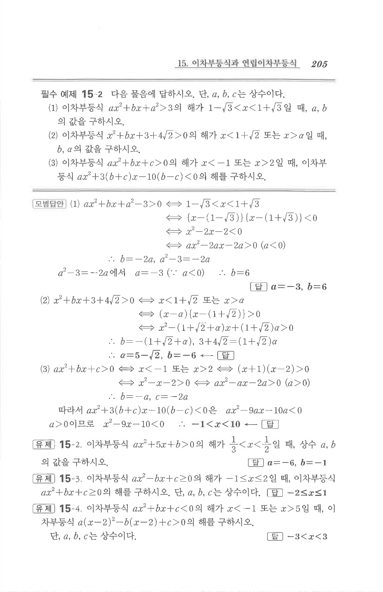

# 필수 예제 15-2

## 문제

다음 물음에 답하시오. 단, $a,b,c$는 상수이다.

1. 이차부등식 $$ax^2+bx+a^2>3$$의 해가 $1-\sqrt3<x<1+\sqrt3$일 때, $a,b$의 값을 구하시오.
2. 이차부등식 $$x^2+bx+3+4\sqrt2>0$$의 해가 $x<1+\sqrt2$ 또는 $x>a$일 때, $b,a$의 값을 구하시오.
3. 이차부등식 $$ax^2+bx+c>0$$의 해가 $x<-1$ 또는 $x>2$일 때, 이차부등식 $$ax^2+3(b+c)x-10(b-c)<0$$의 해를 구하시오.

## 정답

1. $$a=-3,\quad b=6$$
2. $$a=5-\sqrt2,\quad b=-6$$
3. $$-1<x<10$$

## 원문

