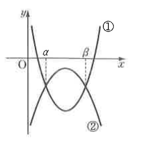

# 필수 예제 15-4

## 문제

오른쪽 그림은 두 이차함수

$$y=ax^2+bx+c\quad(a,b,c\text{는 상수})\qquad \cdots\,①$$
$$y=px^2+qx+r\quad(p,q,r\text{은 상수})\qquad \cdots\,②$$

의 그래프이다. 다음 물음에 답하시오.

1. $b^2-4ac$, $q^2-4pr$의 부호를 조사하시오.
2. $ap^2+bp+c$의 부호를 조사하시오.
3. 부등식 $$(a-p)x^2+(b-q)x+c-r<0$$을 푸시오.
4. $\alpha+\beta$, $\alpha\beta$를 $a,b,c,p,q,r$로 나타내시오.

## 정답

1. $$b^2-4ac>0,\qquad q^2-4pr<0$$
2. $$ap^2+bp+c>0$$
3. $$\alpha<x<\beta$$
4. $$\alpha+\beta=-\dfrac{b-q}{a-p},\qquad \alpha\beta=\dfrac{c-r}{a-p}$$

## 도형

그래프 ①은 위로 열린 포물선이고, 그래프 ②는 아래로 열린 포물선이다. 두 그래프가 서로 다른 두 점에서 만나며, 그 교점들의 $x$좌표가 $\alpha$, $\beta$로 표시되어 있다.

## 원문

