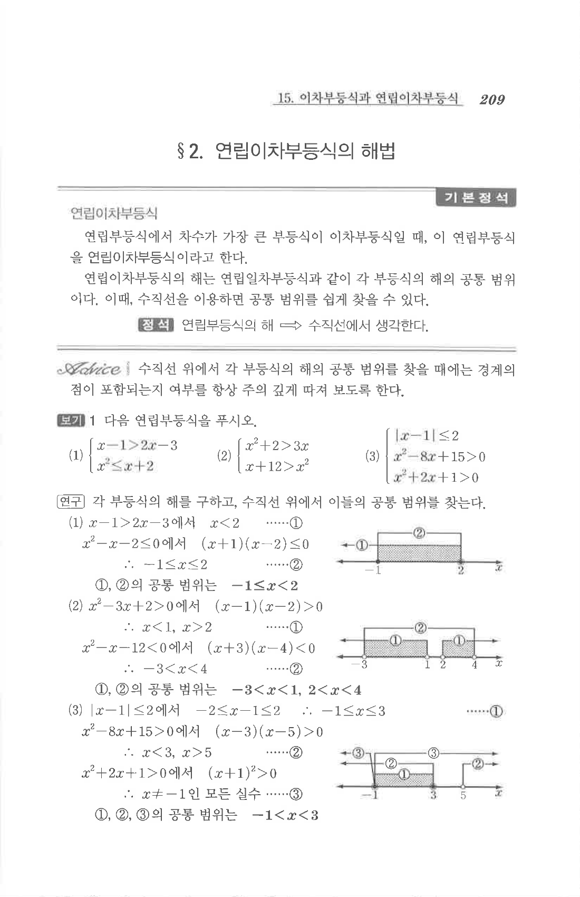

# S2 보기 1

## 문제

다음 연립부등식을 푸시오.

1. $$\begin{cases}x-1>2x-3\\x^2\le x+2\end{cases}$$
2. $$\begin{cases}x^2+2>3x\\x+12>x^2\end{cases}$$
3. $$\begin{cases}|x-1|\le2\\x^2-8x+15>0\\x^2+2x+1>0\end{cases}$$

## 정답

1. $$-1\le x<2$$
2. $$-3<x<1,\quad 2<x<4$$
3. $$-1<x<3$$

## 원문

