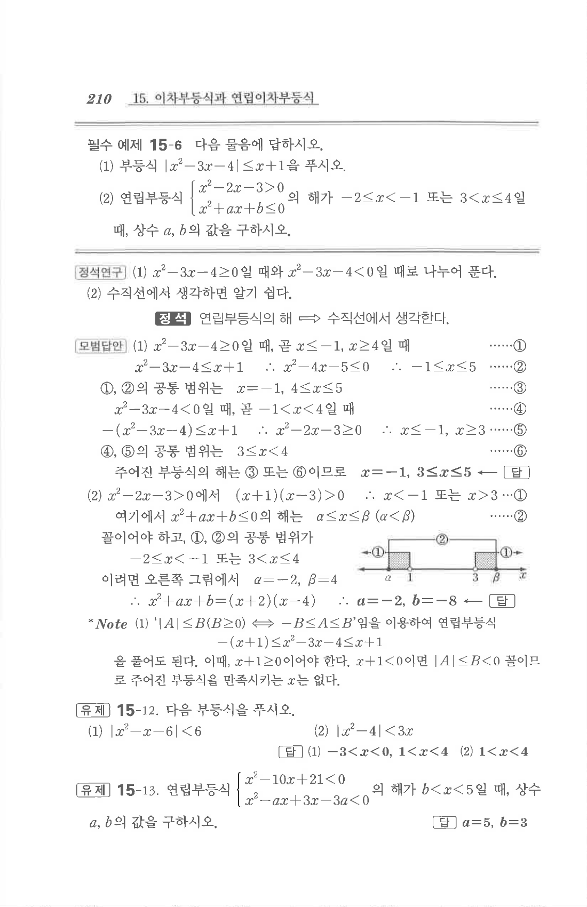

# 필수 예제 15-6

## 문제

다음 물음에 답하시오.

1. 부등식 $$|x^2-3x-4|\le x+1$$을 푸시오.
2. 연립부등식 $$\begin{cases}x^2-2x-3>0\\x^2+ax+b\le0\end{cases}$$의 해가 $-2\le x<-1$ 또는 $3<x\le4$일 때, 상수 $a,b$의 값을 구하시오.

## 정답

1. $$x=-1,\quad 3\le x\le5$$
2. $$a=-2,\quad b=-8$$

## 원문

