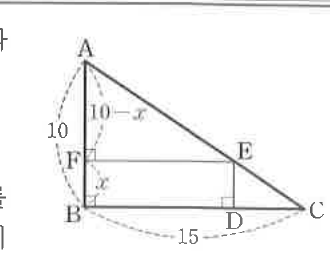

# 필수 예제 15-9

## 문제

$AB=10$, $BC=15$, $\angle B=90^\circ$인 $\triangle ABC$의 세 변 $BC$, $CA$, $AB$ 위에 각각 점 $D,E,F$가 있다. 사각형 $BDEF$가 직사각형이고 넓이가 $24$ 이상 $30$ 미만일 때, 선분 $BF$의 길이의 범위를 구하시오.

## 정답

$$2\le BF<5-\sqrt5,\qquad 5+\sqrt5<BF\le8$$

## 도형

직각삼각형 $ABC$에서 $AB=10$, $BC=15$이고, $B$가 직각이다. 점 $F$는 $AB$ 위, 점 $D$는 $BC$ 위, 점 $E$는 $CA$ 위에 있으며 $BDEF$가 직사각형이다. 그림에서는 $BF=x$, $AF=10-x$로 표시되어 있다.

## 원문

