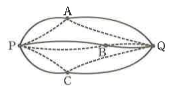
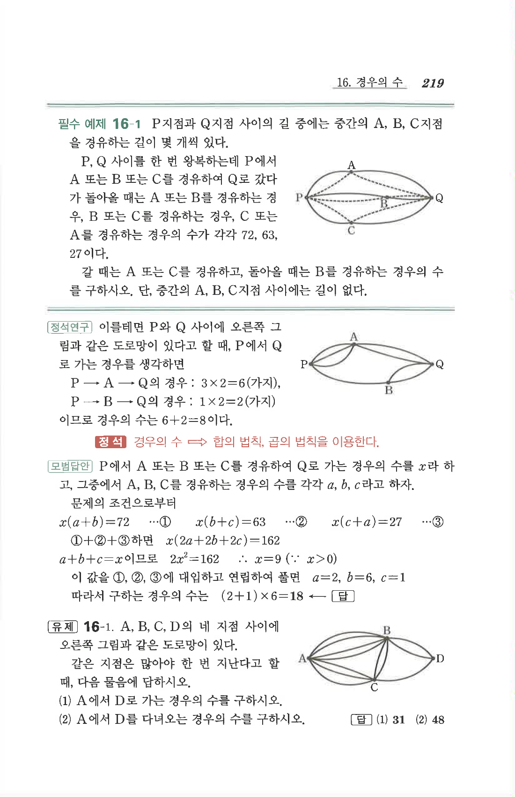

# 필수 예제 16-1

## 문제

P지점과 Q지점 사이의 길 중에는 중간의 A, B, C지점을 경유하는 길이 몇 개씩 있다.

P, Q 사이를 한 번 왕복하는데 P에서 A 또는 B 또는 C를 경유하여 Q로 갔다가 돌아올 때는 A 또는 B를 경유하는 경우, B 또는 C를 경유하는 경우, C 또는 A를 경유하는 경우의 수가 각각 $72$, $63$, $27$이다.

갈 때는 A 또는 C를 경유하고, 돌아올 때는 B를 경유하는 경우의 수를 구하시오. 단, 중간의 A, B, C지점 사이에는 길이 없다.

## 정답

$$18$$

## 도형

P와 Q 사이에 중간 지점 A, B, C가 있고, P에서 각 중간 지점으로 가는 길들과 각 중간 지점에서 Q로 가는 길들이 여러 개 그려져 있다. 중간 지점끼리는 직접 연결되어 있지 않다.

## 원문

