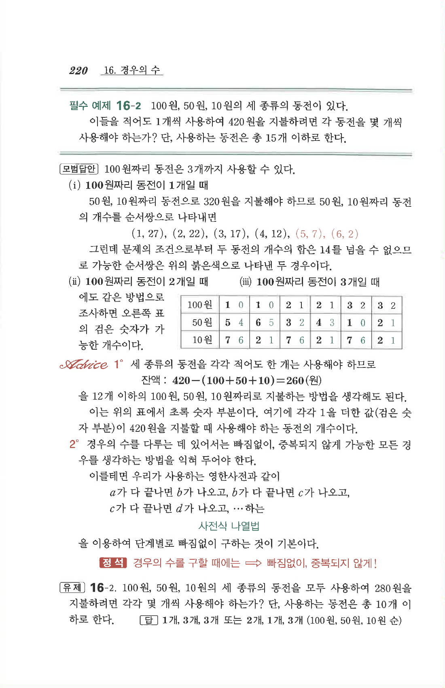

# 필수 예제 16-2

## 문제

$100$원, $50$원, $10$원의 세 종류의 동전이 있다. 이들을 적어도 $1$개씩 사용하여 $420$원을 지불하려면 각 동전을 몇 개씩 사용해야 하는가? 단, 사용하는 동전은 총 $15$개 이하로 한다.

## 정답

$(100\text{원},50\text{원},10\text{원})$의 개수는 다음 $6$가지이다.

$$(1,5,7),\ (1,6,2),\ (2,3,7),\ (2,4,2),\ (3,1,7),\ (3,2,2)$$

## 원문

