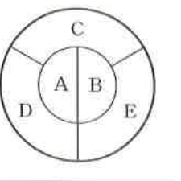
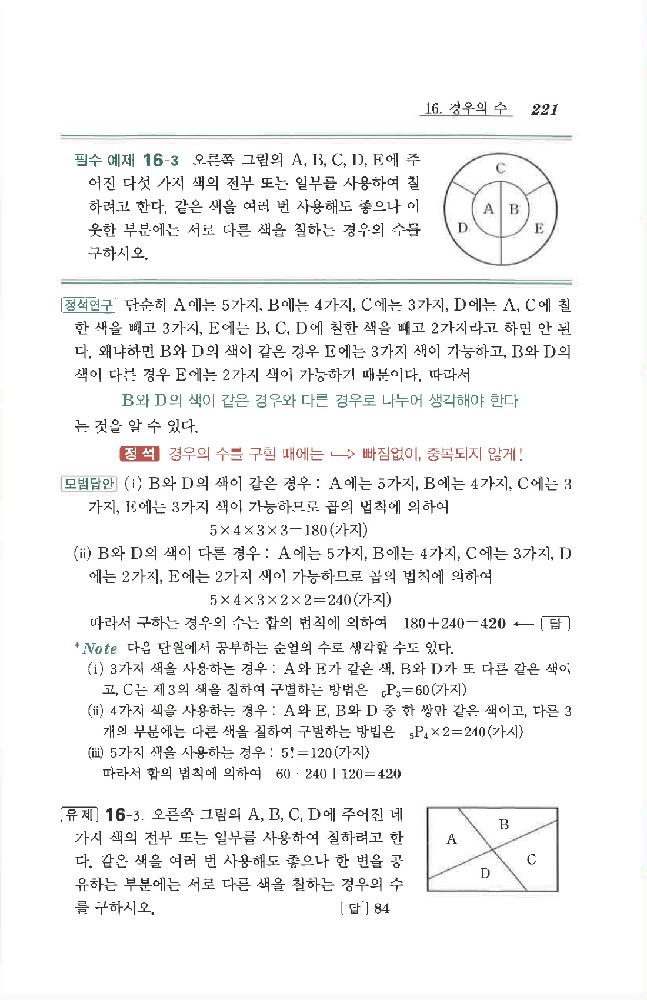

# 필수 예제 16-3

## 문제

오른쪽 그림의 A, B, C, D, E에 주어진 다섯 가지 색의 전부 또는 일부를 사용하여 칠하려고 한다. 같은 색을 여러 번 사용해도 좋으나 이웃한 부분에는 서로 다른 색을 칠하는 경우의 수를 구하시오.

## 정답

$$420$$

## 도형

원 모양의 영역이 A, B, C, D, E 다섯 부분으로 나누어져 있다. A와 B는 중앙의 원 내부를 세로로 나눈 두 부분이고, C, D, E는 바깥 고리의 위쪽, 왼쪽 아래, 오른쪽 아래 부분이다.

## 원문

