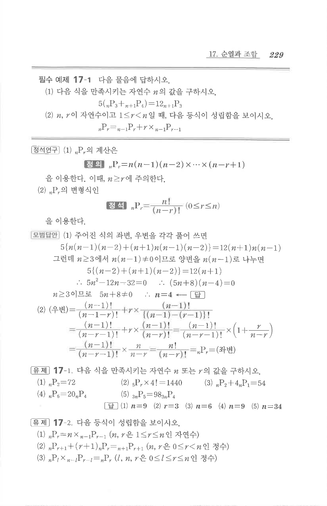

# 필수 예제 17-1

## 문제

다음 물음에 답하시오.

1. 다음 식을 만족시키는 자연수 $n$의 값을 구하시오.
$$5\left({}_nP_3+{}_{n+1}P_4\right)=12{}_{n+1}P_3$$
2. $n,r$이 자연수이고 $1\le r<n$일 때, 다음 등식이 성립함을 보이시오.
$${}_nP_r={}_{n-1}P_r+r\times{}_{n-1}P_{r-1}$$

## 정답

1. $$n=4$$
2. 증명 문제

## 원문

