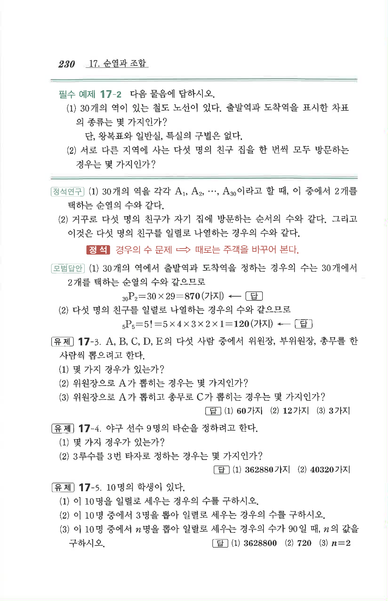

# 필수 예제 17-2

## 문제

다음 물음에 답하시오.

1. $30$개의 역이 있는 철도 노선이 있다. 출발역과 도착역을 표시한 차표의 종류는 몇 가지인가? 단, 왕복표와 일반실, 특실의 구별은 없다.
2. 서로 다른 지역에 사는 다섯 명의 친구 집을 한 번씩 모두 방문하는 경우는 몇 가지인가?

## 정답

1. $$870\text{가지}$$
2. $$120\text{가지}$$

## 원문

