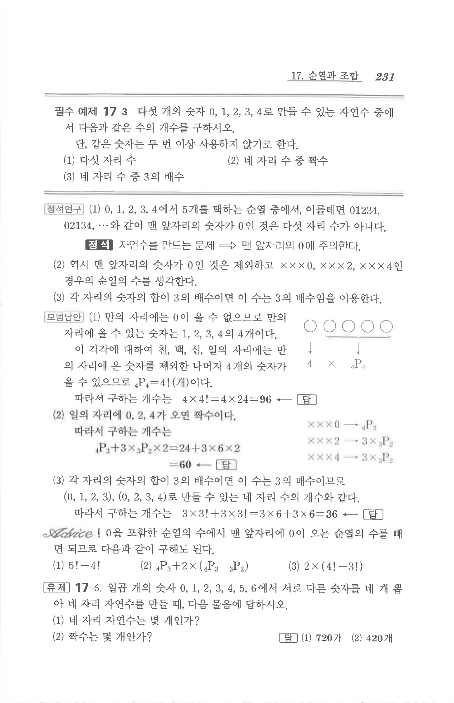

# 필수 예제 17-3

## 문제

다섯 개의 숫자 $0,1,2,3,4$로 만들 수 있는 자연수 중에서 다음과 같은 수의 개수를 구하시오. 단, 같은 숫자는 두 번 이상 사용하지 않기로 한다.

1. 다섯 자리 수
2. 네 자리 수 중 짝수
3. 네 자리 수 중 $3$의 배수

## 정답

1. $$96$$
2. $$60$$
3. $$36$$

## 원문

