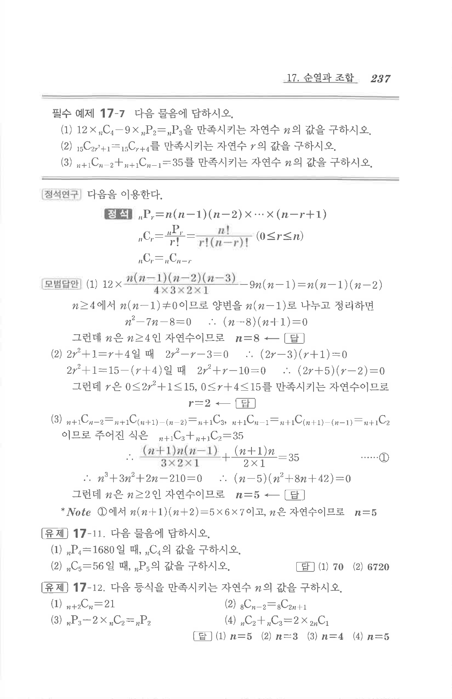

# 필수 예제 17-7

## 문제

다음 물음에 답하시오.

1. $$12\times{}_nC_4-9\times{}_nP_2={}_nP_3$$을 만족시키는 자연수 $n$의 값을 구하시오.
2. $$_{15}C_{2r^2+1}={}_{15}C_{r+4}$$를 만족시키는 자연수 $r$의 값을 구하시오.
3. $$_{n+1}C_{n-2}+{}_{n+1}C_{n-1}=35$$를 만족시키는 자연수 $n$의 값을 구하시오.

## 정답

1. $$n=8$$
2. $$r=2$$
3. $$n=5$$

## 원문

