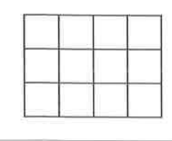

# 필수 예제 17-12

## 문제

다음 그림과 같이 가로줄 네 개와 세로줄 다섯 개가 같은 간격으로 수직으로 만나도록 그어져 있다.

1. 직사각형의 개수를 구하시오.
2. 정사각형이 아닌 직사각형의 개수를 구하시오.
3. $20$개의 교점에서 세 점을 택하여 만들 수 있는 삼각형의 개수를 구하시오.

## 정답

1. $$60$$
2. $$40$$
3. $$1056$$

## 도형

가로줄 $4$개와 세로줄 $5$개가 같은 간격으로 수직으로 만나며, 전체적으로 $3\times4$개의 작은 직사각형 격자를 이룬다.

## 원문

