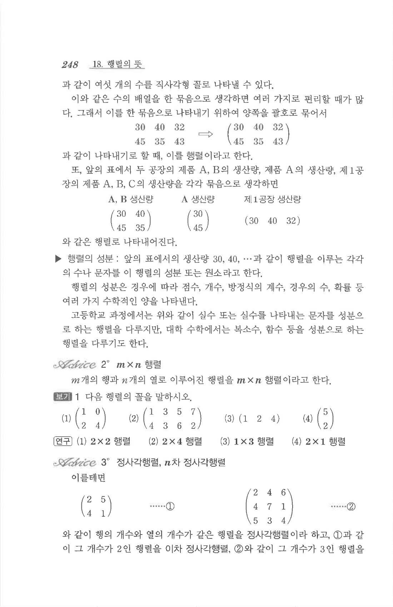

# S1 보기 1

## 문제

다음 행렬의 꼴을 말하시오.

1. $$\begin{pmatrix}1&0\\2&4\end{pmatrix}$$
2. $$\begin{pmatrix}1&3&5&7\\4&3&6&2\end{pmatrix}$$
3. $$\begin{pmatrix}1&2&4\end{pmatrix}$$
4. $$\begin{pmatrix}5\\2\end{pmatrix}$$

## 정답

1. $2\times2$ 행렬
2. $2\times4$ 행렬
3. $1\times3$ 행렬
4. $2\times1$ 행렬

## 원문

