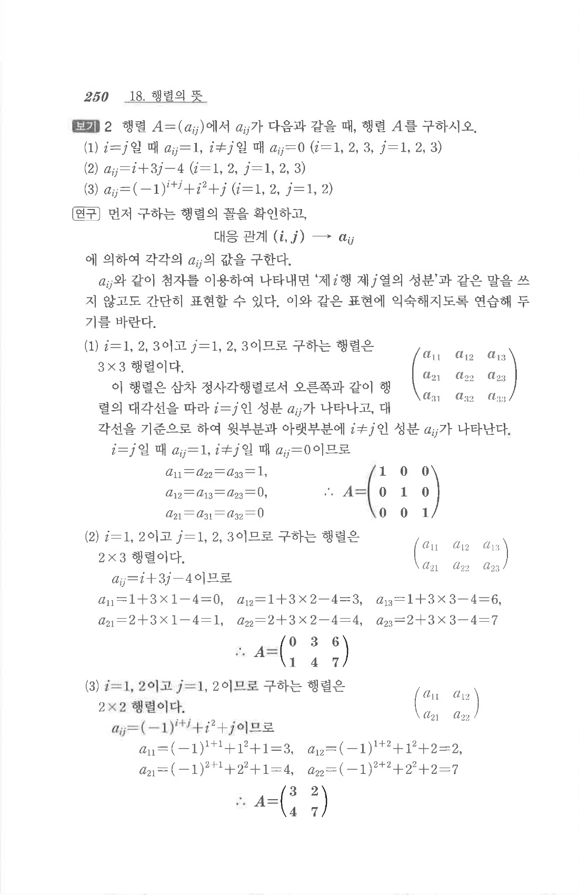

# S1 보기 2

## 문제

행렬 $A=(a_{ij})$에서 $a_{ij}$가 다음과 같을 때, 행렬 $A$를 구하시오.

1. $i=j$일 때 $a_{ij}=1$, $i\ne j$일 때 $a_{ij}=0$ $(i=1,2,3,\ j=1,2,3)$
2. $$a_{ij}=i+3j-4\quad(i=1,2,\ j=1,2,3)$$
3. $$a_{ij}=(-1)^{i+j}+i^2+j\quad(i=1,2,\ j=1,2)$$

## 정답

1. $$A=\begin{pmatrix}1&0&0\\0&1&0\\0&0&1\end{pmatrix}$$
2. $$A=\begin{pmatrix}0&3&6\\1&4&7\end{pmatrix}$$
3. $$A=\begin{pmatrix}3&2\\4&7\end{pmatrix}$$

## 원문

