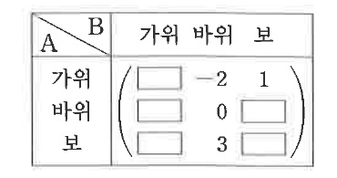
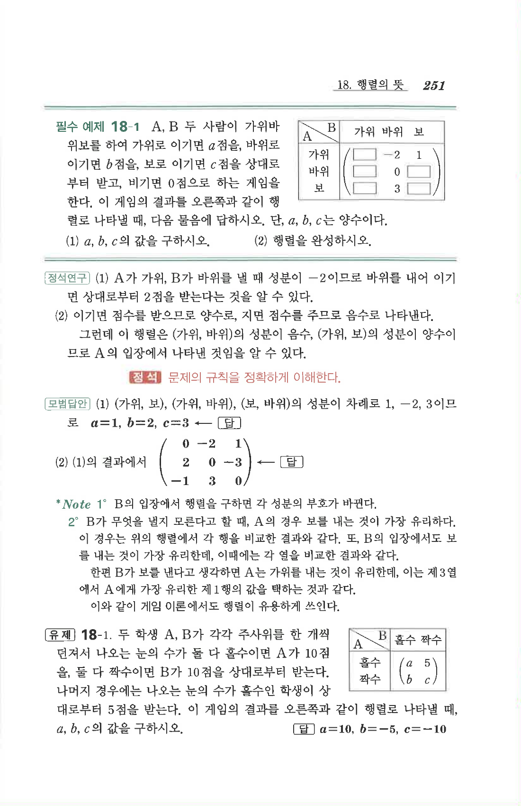

# 필수 예제 18-1

## 문제

A, B 두 사람이 가위바위보를 하여 가위로 이기면 $a$점을, 바위로 이기면 $b$점을, 보로 이기면 $c$점을 상대로부터 받고, 비기면 $0$점으로 하는 게임을 한다. 이 게임의 결과를 오른쪽과 같이 행렬로 나타낼 때, 다음 물음에 답하시오. 단, $a,b,c$는 양수이다.

1. $a,b,c$의 값을 구하시오.
2. 행렬을 완성하시오.

## 정답

1. $$a=1,\quad b=2,\quad c=3$$
2. $$\begin{pmatrix}0&-2&1\\2&0&-3\\-1&3&0\end{pmatrix}$$

## 도형

A의 선택이 행, B의 선택이 열인 가위바위보 점수표이다. 일부 성분으로 $-2$, $1$, $0$, $3$이 표시되어 있다.

## 원문

