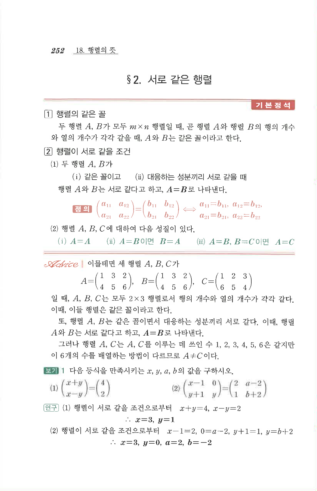

# S2 보기 1

## 문제

다음 등식을 만족시키는 $x,y,a,b$의 값을 구하시오.

1. $$\begin{pmatrix}x+y\\x-y\end{pmatrix}=\begin{pmatrix}4\\2\end{pmatrix}$$
2. $$\begin{pmatrix}x-1&0\\y+1&y\end{pmatrix}=\begin{pmatrix}2&a-2\\1&b+2\end{pmatrix}$$

## 정답

1. $$x=3,\quad y=1$$
2. $$x=3,\quad y=0,\quad a=2,\quad b=-2$$

## 원문

