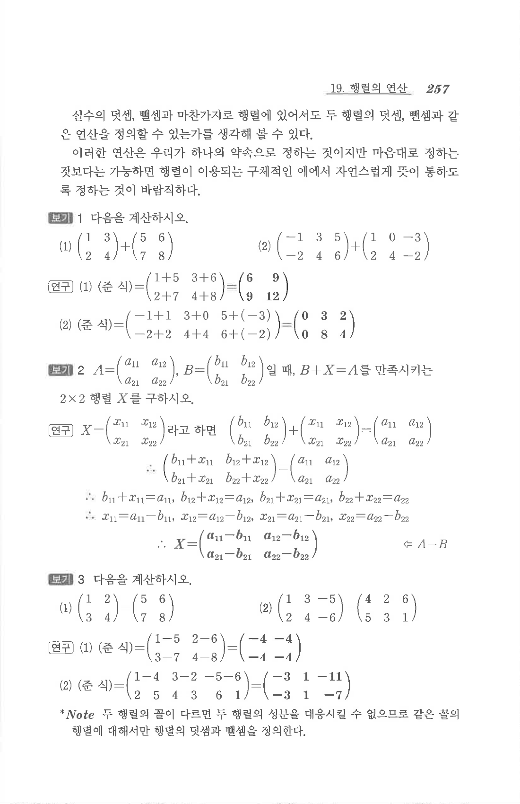

# S1 보기 3

## 문제

다음을 계산하시오.

1. $$\begin{pmatrix}1&2\\3&4\end{pmatrix}-\begin{pmatrix}5&6\\7&8\end{pmatrix}$$
2. $$\begin{pmatrix}1&3&-5\\2&4&-6\end{pmatrix}-\begin{pmatrix}4&2&6\\5&3&1\end{pmatrix}$$

## 정답

1. $$\begin{pmatrix}-4&-4\\-4&-4\end{pmatrix}$$
2. $$\begin{pmatrix}-3&1&-11\\-3&1&-7\end{pmatrix}$$

## 원문

