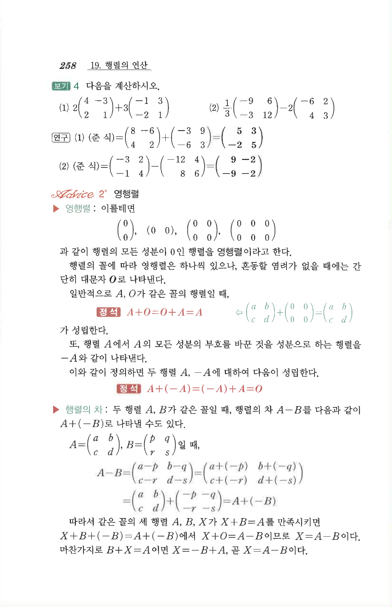

# S1 보기 4

## 문제

다음을 계산하시오.

1. $$2\begin{pmatrix}4&-3\\2&1\end{pmatrix}+3\begin{pmatrix}-1&3\\-2&1\end{pmatrix}$$
2. $$\frac13\begin{pmatrix}-9&6\\-3&12\end{pmatrix}-2\begin{pmatrix}-6&2\\4&3\end{pmatrix}$$

## 정답

1. $$\begin{pmatrix}5&3\\-2&5\end{pmatrix}$$
2. $$\begin{pmatrix}9&-2\\-9&-2\end{pmatrix}$$

## 원문

