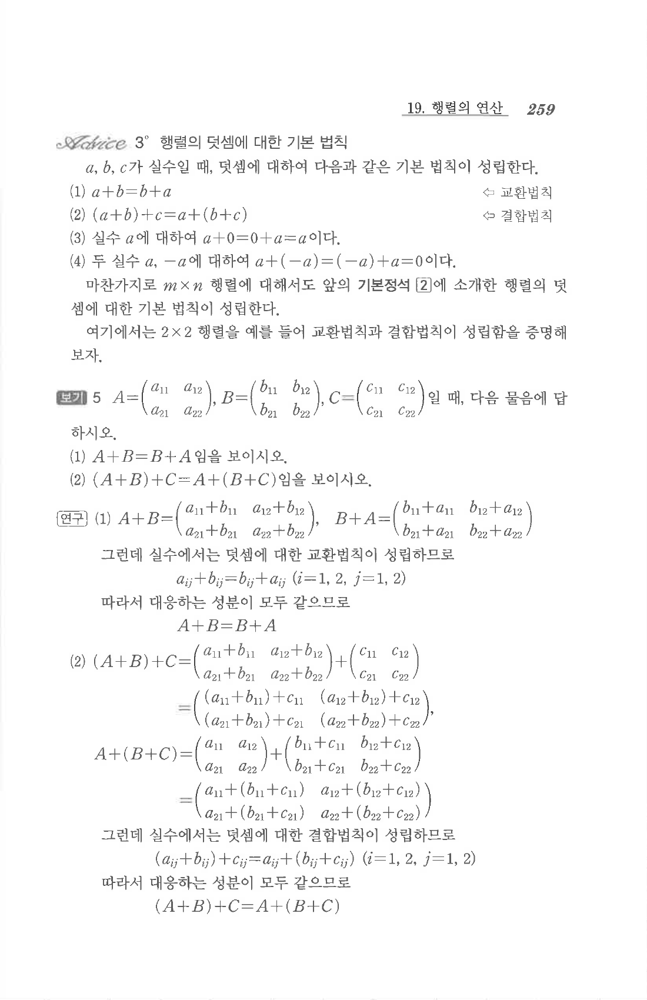

# S1 보기 5

## 문제

$$A=\begin{pmatrix}a_{11}&a_{12}\\a_{21}&a_{22}\end{pmatrix},\quad
B=\begin{pmatrix}b_{11}&b_{12}\\b_{21}&b_{22}\end{pmatrix},\quad
C=\begin{pmatrix}c_{11}&c_{12}\\c_{21}&c_{22}\end{pmatrix}$$
일 때, 다음 물음에 답하시오.

1. $A+B=B+A$임을 보이시오.
2. $(A+B)+C=A+(B+C)$임을 보이시오.

## 정답

1. 대응하는 각 성분에서 $a_{ij}+b_{ij}=b_{ij}+a_{ij}$이므로 $A+B=B+A$이다.
2. 대응하는 각 성분에서 $(a_{ij}+b_{ij})+c_{ij}=a_{ij}+(b_{ij}+c_{ij})$이므로 $(A+B)+C=A+(B+C)$이다.

## 원문

