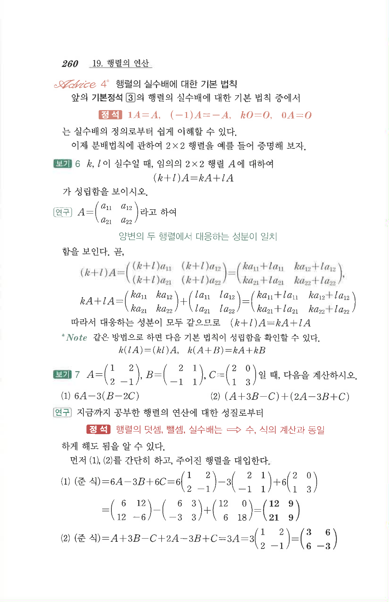

# S1 보기 7

## 문제

$$A=\begin{pmatrix}1&2\\2&-1\end{pmatrix},\quad
B=\begin{pmatrix}2&1\\-1&1\end{pmatrix},\quad
C=\begin{pmatrix}2&0\\1&3\end{pmatrix}$$
일 때, 다음을 계산하시오.

1. $6A-3(B-2C)$
2. $(A+3B-C)+(2A-3B+C)$

## 정답

1. $$\begin{pmatrix}12&9\\21&9\end{pmatrix}$$
2. $$\begin{pmatrix}3&6\\6&-3\end{pmatrix}$$

## 원문

