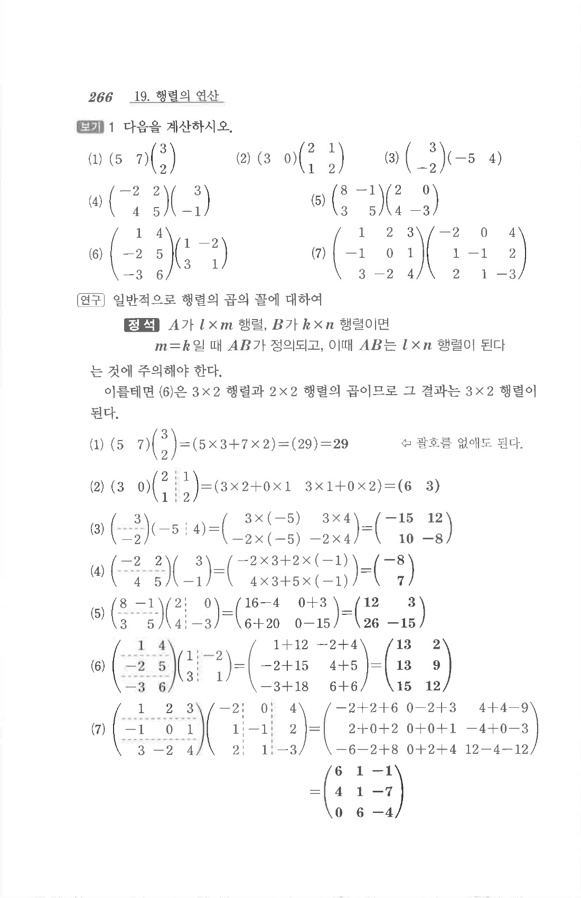

# S2 보기 1

## 문제

다음을 계산하시오.

1. $$\begin{pmatrix}5&7\end{pmatrix}\begin{pmatrix}3\\2\end{pmatrix}$$
2. $$\begin{pmatrix}3&0\end{pmatrix}\begin{pmatrix}2&1\\1&2\end{pmatrix}$$
3. $$\begin{pmatrix}3\\-2\end{pmatrix}\begin{pmatrix}-5&4\end{pmatrix}$$
4. $$\begin{pmatrix}-2&2\\4&5\end{pmatrix}\begin{pmatrix}3\\-1\end{pmatrix}$$
5. $$\begin{pmatrix}8&-1\\3&5\end{pmatrix}\begin{pmatrix}2&0\\4&-3\end{pmatrix}$$
6. $$\begin{pmatrix}1&4\\-2&5\\-3&6\end{pmatrix}\begin{pmatrix}1&-2\\3&1\end{pmatrix}$$
7. $$\begin{pmatrix}1&2&3\\-1&0&1\\3&-2&4\end{pmatrix}\begin{pmatrix}-2&0&4\\1&-1&2\\2&1&-3\end{pmatrix}$$

## 정답

1. $29$
2. $$\begin{pmatrix}6&3\end{pmatrix}$$
3. $$\begin{pmatrix}-15&12\\10&-8\end{pmatrix}$$
4. $$\begin{pmatrix}-8\\7\end{pmatrix}$$
5. $$\begin{pmatrix}12&3\\26&-15\end{pmatrix}$$
6. $$\begin{pmatrix}13&2\\13&9\\15&12\end{pmatrix}$$
7. $$\begin{pmatrix}6&1&-1\\4&1&-7\\0&6&-4\end{pmatrix}$$

## 원문

