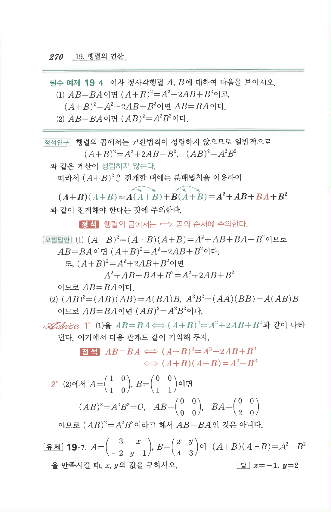

# 필수 예제 19-4

## 문제

이차 정사각행렬 $A,B$에 대하여 다음을 보이시오.

1. $AB=BA$이면 $(A+B)^2=A^2+2AB+B^2$이고, $(A+B)^2=A^2+2AB+B^2$이면 $AB=BA$이다.
2. $AB=BA$이면 $(AB)^2=A^2B^2$이다.

## 정답

1. $(A+B)^2=A^2+AB+BA+B^2$를 이용하면 된다.
2. $(AB)^2=A(BA)B$이고, $AB=BA$이면 $A(AB)B=A^2B^2$이다.

## 원문

