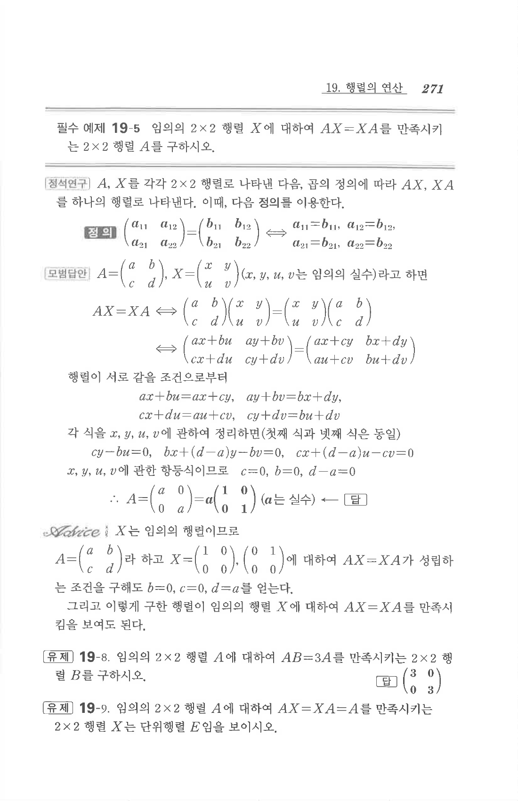

# 필수 예제 19-5

## 문제

임의의 $2\times2$ 행렬 $X$에 대하여 $AX=XA$를 만족시키는 $2\times2$ 행렬 $A$를 구하시오.

## 정답

$$A=\begin{pmatrix}a&0\\0&a\end{pmatrix}=a\begin{pmatrix}1&0\\0&1\end{pmatrix}\quad(a\in\mathbb{R})$$

## 원문

