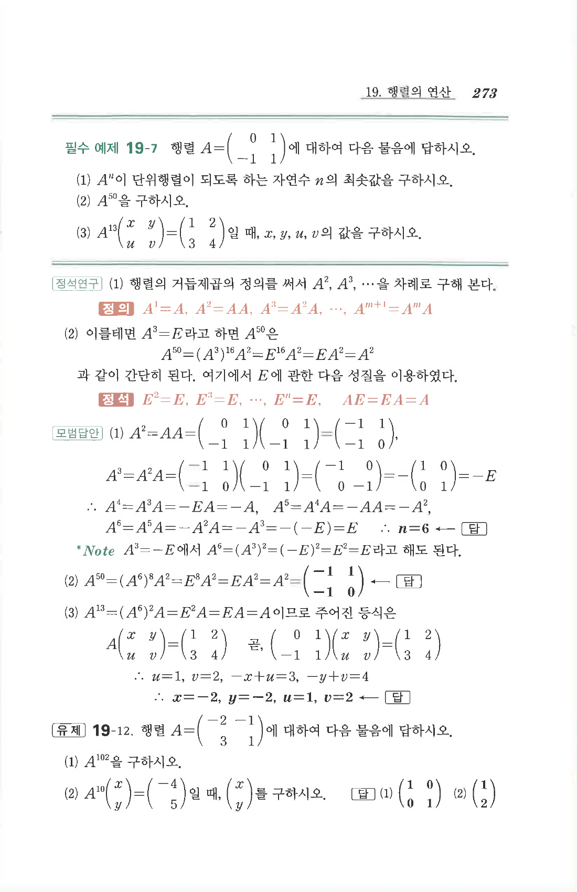

# 필수 예제 19-7

## 문제

행렬
$$A=\begin{pmatrix}0&1\\-1&1\end{pmatrix}$$
에 대하여 다음 물음에 답하시오.

1. $A^n$이 단위행렬이 되도록 하는 자연수 $n$의 최솟값을 구하시오.
2. $A^{50}$을 구하시오.
3. $$A^{13}\begin{pmatrix}x&y\\u&v\end{pmatrix}=\begin{pmatrix}1&2\\3&4\end{pmatrix}$$
일 때, $x,y,u,v$의 값을 구하시오.

## 정답

1. $$n=6$$
2. $$A^{50}=\begin{pmatrix}-1&1\\-1&0\end{pmatrix}$$
3. $$x=-2,\quad y=-2,\quad u=1,\quad v=2$$

## 원문

