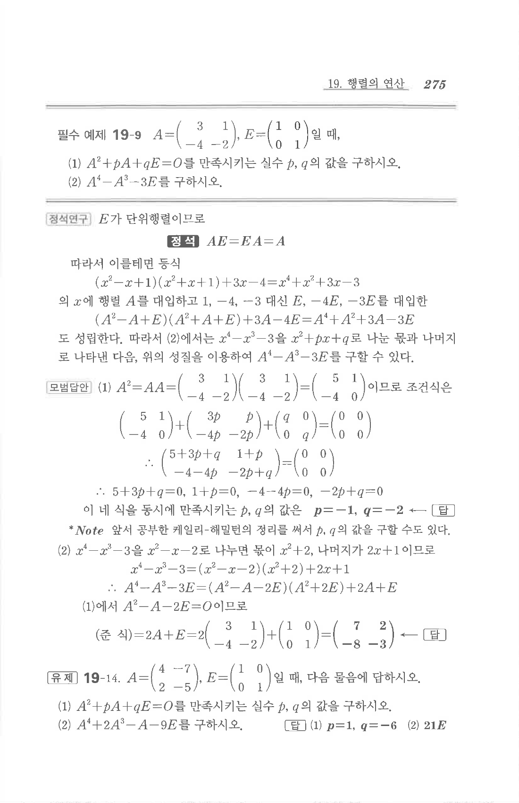

# 필수 예제 19-9

## 문제

$$A=\begin{pmatrix}3&1\\-4&-2\end{pmatrix},\quad E=\begin{pmatrix}1&0\\0&1\end{pmatrix}$$
일 때,

1. $A^2+pA+qE=O$를 만족시키는 실수 $p,q$의 값을 구하시오.
2. $A^4-A^3-3E$를 구하시오.

## 정답

1. $$p=-1,\quad q=-2$$
2. $$A^4-A^3-3E=\begin{pmatrix}7&2\\-8&-3\end{pmatrix}$$

## 원문

