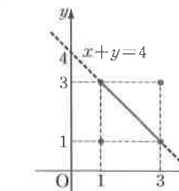

# 필수 예제 19-10

## 문제

$$A=\begin{pmatrix}x&z\\z&y\end{pmatrix},\quad E=\begin{pmatrix}1&0\\0&1\end{pmatrix}$$
이 $A^2-4A+3E=O$를 만족시킬 때, 점 $(x,y)$가 존재하는 부분을 좌표평면 위에 나타내시오. 단, $x,y,z$는 실수이다.

## 정답

점 $(1,1)$, $(3,3)$ 및 직선 $x+y=4$ 위의 닫힌 선분 $1\le x\le3$이다.

## 도형

좌표평면에 직선 $x+y=4$가 그려져 있고, $x=1$에서 $y=3$, $x=3$에서 $y=1$까지의 선분이 표시되어 있다. 또한 점 $(1,1)$과 $(3,3)$이 별도로 표시되어 있다.

## 원문

