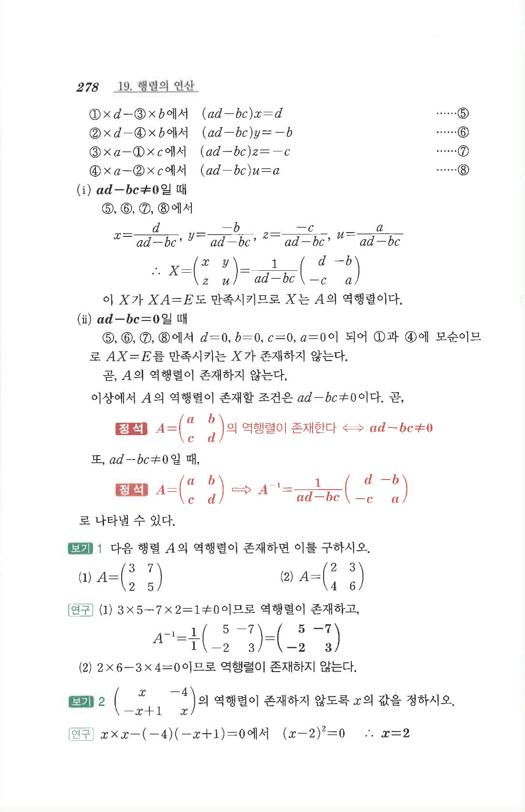

# 보충 보기 1

## 문제

다음 행렬 $A$의 역행렬이 존재하면 이를 구하시오.

1. $$A=\begin{pmatrix}3&7\\2&5\end{pmatrix}$$
2. $$A=\begin{pmatrix}2&3\\4&6\end{pmatrix}$$

## 정답

1. $$A^{-1}=\begin{pmatrix}5&-7\\-2&3\end{pmatrix}$$
2. 역행렬이 존재하지 않는다.

## 원문

