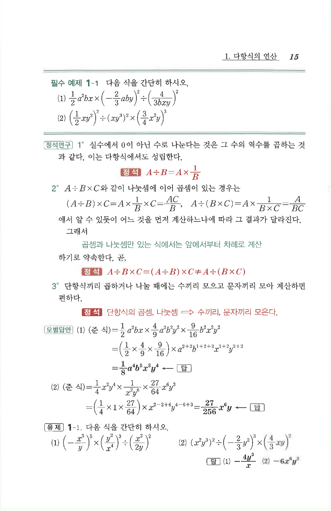

# 유제 1-1

## 문제

다음 식을 간단히 하시오.

1. $$\left(-\frac{x^3}{y}\right)^5\times\left(\frac{y^2}{x^4}\right)^3\div\left(\frac{x^2}{2y}\right)^2$$
2. $$(x^2y^3)^2\div\left(-\frac23y^2\right)^3\times\left(\frac43xy\right)^2$$

## 정답

1. $$-\frac{4y^3}{x}$$
2. $$-6x^6y^2$$

## 원문

