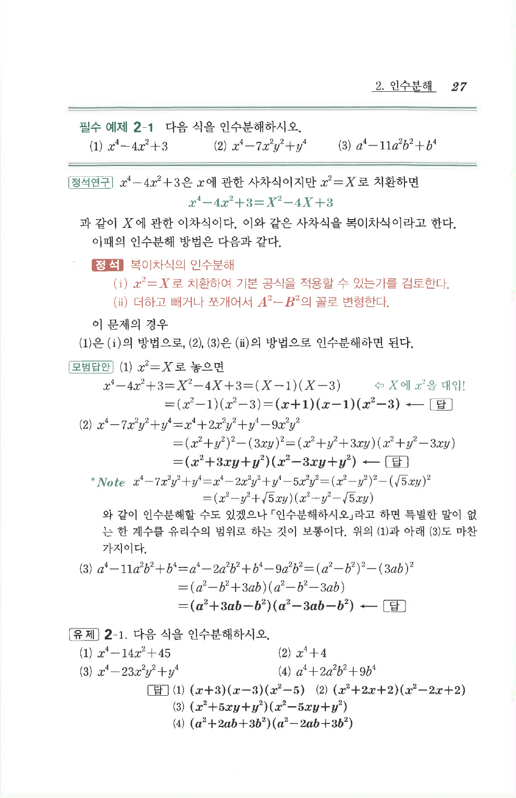

# 유제 2-1

## 문제

다음 식을 인수분해하시오.

1. $$x^4-14x^2+45$$
2. $$x^4+4$$
3. $$x^4-23x^2y^2+y^4$$
4. $$a^4+2a^2b^2+9b^4$$

## 정답

1. $$(x+3)(x-3)(x^2-5)$$
2. $$(x^2+2x+2)(x^2-2x+2)$$
3. $$(x^2+5xy+y^2)(x^2-5xy+y^2)$$
4. $$(a^2+2ab+3b^2)(a^2-2ab+3b^2)$$

## 원문

