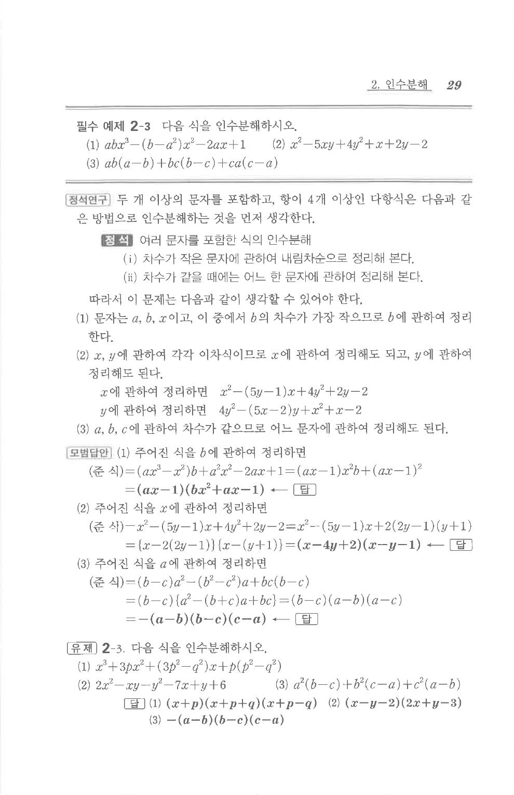

# 유제 2-3

## 문제

다음 식을 인수분해하시오.

1. $$x^3+3px^2+(3p^2-q^2)x+p(p^2-q^2)$$
2. $$2x^2-xy-y^2-7x+y+6$$
3. $$a^2(b-c)+b^2(c-a)+c^2(a-b)$$

## 정답

1. $$(x+p)(x+p+q)(x+p-q)$$
2. $$(x-y-2)(2x+y-3)$$
3. $$-(a-b)(b-c)(c-a)$$

## 원문

