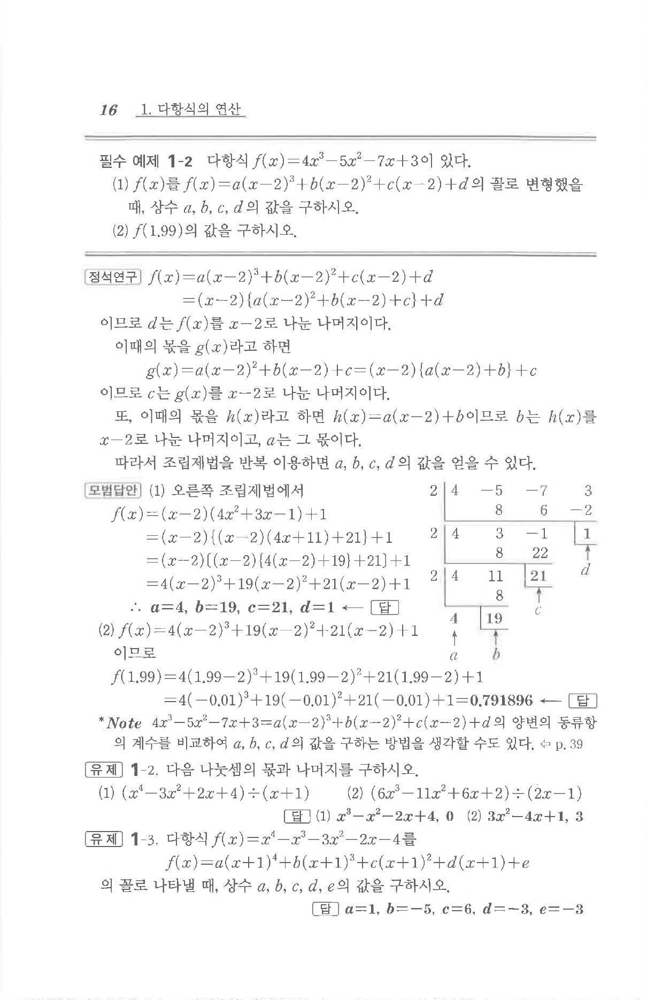

# 유제 1-3

## 문제

다항식

$$f(x)=x^4-x^3-3x^2-2x-4$$

를

$$f(x)=a(x+1)^4+b(x+1)^3+c(x+1)^2+d(x+1)+e$$

의 꼴로 나타낼 때, 상수 $a,b,c,d,e$의 값을 구하시오.

## 정답

$$a=1,\quad b=-5,\quad c=6,\quad d=-3,\quad e=-3$$

## 원문

